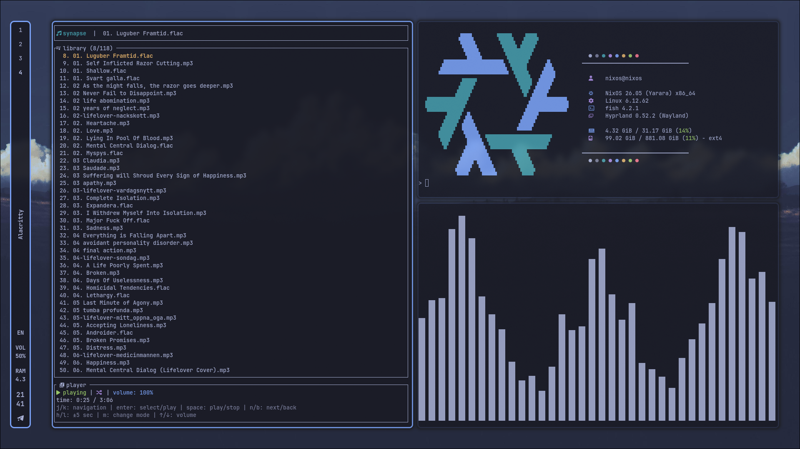
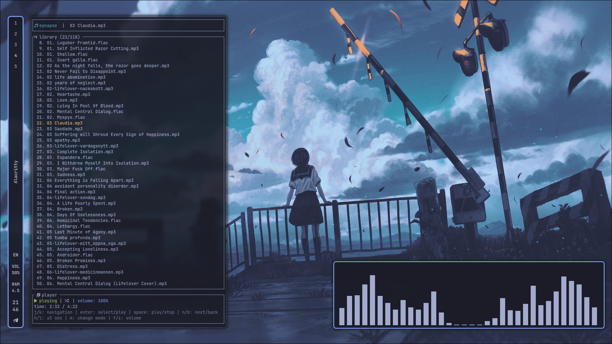

<div align="center">

## Synapse :volcano:

<p align="center">
  
  
  
  
  
  
  
  
  
</p>

---

<div align="center">
  <a>
    Synapse is a lightweight terminal music player built with Rust. 
    It brings the core features of desktop players into the CLI, powered by Vim-style keybindings. 
    While designed specifically for NixOS and its declarative ecosystem, it can be adapted for other Linux distributions with some extra effort.
  </a>
</div>

---
</div>

## 📸 Screenshot
<p align="center">
  
  
</p>

---

## 📦 Get Started

### Quick Run
You don't even need to install it. 
Just run:

```bash
# Run with your music directory
> nix run github:mains-hum/synapse -- ~/music
```

### Flake

```bash
{
  inputs.synapse.url = "github:mains-hum/synapse";
  
  outputs = { self, nixpkgs, synapse, ... }: {
    nixosConfigurations.nixos = nixpkgs.lib.nixosSystem {
      modules = [
        { environment.systemPackages = [ synapse.packages.x86_64-linux.default ]; }
      ];
    };
  };
}
```
```bash
#Run with your music directory
> synapce ~/music
```

---

<div align="center">
⭐ Star this repo if you find it helpful!
Made with by mains-hum
</div>

---

## 📝 License

nix-dotf  Copyright (C) 2025-2040  mains-hum

See the [LICENSE](LICENSE) file for details.

</div>
